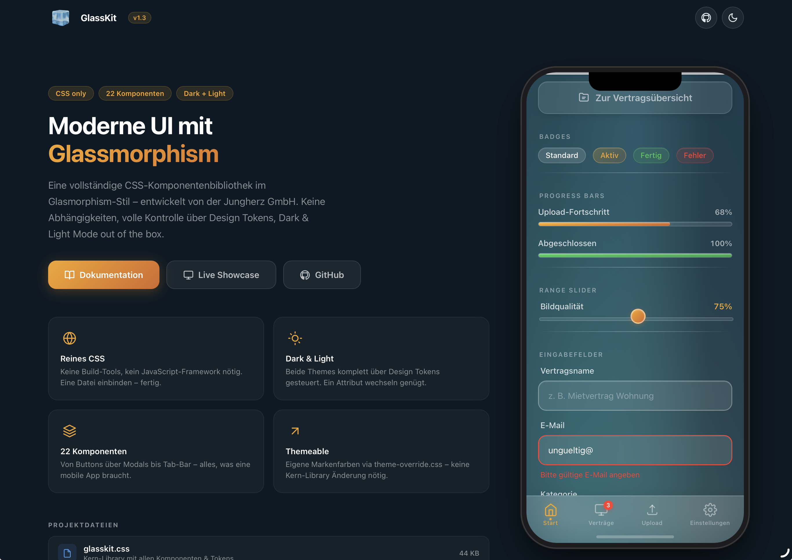

<p align="center">
  
  
  
  
  <a href="CHANGELOG.md"></a>
  <a href="https://www.npmjs.com/package/@jungherz-de/glasskit"></a>
  <a href="https://cdn.jsdelivr.net/npm/@jungherz-de/glasskit/"></a>
</p>

<h1 align="center">🧊 GlassKit</h1>

<p align="center">
  
</p>

<p align="center">
  <strong>A modern glassmorphism CSS component library.</strong><br>
  22 Komponenten · Dark & Light Mode · Keine Abhängigkeiten · Design Tokens
</p>

<p align="center">
  <a href="#-installation">Installation</a> ·
  <a href="#-quick-start">Quick Start</a> ·
  <a href="#-komponenten">Komponenten</a> ·
  <a href="#-theming">Theming</a> ·
  <a href="#-web-components--shadow-dom">Web Components</a> ·
  <a href="#-dokumentation">Docs</a> ·
  <a href="CHANGELOG.md">Changelog</a> ·
  <a href="#-lizenz">Lizenz</a>
</p>

---

## ✨ Was ist GlassKit?

GlassKit ist eine vollständige **CSS-Komponentenbibliothek** im Glassmorphism-Stil – inspiriert von **iOS 26 Liquid Glass** und visionOS. Apple hat mit iOS 26 das Glasdesign grundlegend neu definiert: tiefere Blur-Effekte, leuchtende Ränder und dynamische Lichtreflexe auf Oberflächen. GlassKit bringt genau diesen Look ins Web – für Apps und UIs, die sich modern und nativ anfühlen.

**Eine CSS-Datei. Keine Build-Tools. Keine Abhängigkeiten.**

<br>

### Warum GlassKit?

- 🎨 **Reines CSS** – kein JavaScript-Framework nötig
- 🌗 **Dark & Light Mode** – ein Attribut wechseln genügt
- 🎛️ **Design Tokens** – alle Werte zentral über CSS Custom Properties steuerbar
- 📱 **Mobile-first** – optimiert für Touch-Geräte und `safe-area-inset`
- 🔌 **Framework-agnostisch** – funktioniert mit React, Vue, Svelte, plain HTML oder jedem anderen Stack
- 🧩 **Shadow-DOM-ready** – Constructable Stylesheet für Web Components mitgeliefert
- 🪶 **Leichtgewichtig** – ~45 KB (unkomprimiert), keine externen Abhängigkeiten
- 🎯 **BEM-artige Namenskonvention** – `glass-*` Prefix, kein Konflikt mit bestehendem CSS

---

## 📥 Installation

GlassKit kann auf verschiedenen Wegen eingebunden werden – wähle den, der am besten zu deinem Projekt passt:

### CDN (empfohlen für schnellen Einstieg)

Kein Download, kein Build-Tool – einfach einbinden und loslegen:

```html
<!-- jsDelivr – Minifiziert -->
<link rel="stylesheet" href="https://cdn.jsdelivr.net/npm/@jungherz-de/glasskit@1.3.0/glasskit.min.css">

<!-- jsDelivr – Unminifiziert (zum Lesen/Debuggen) -->
<link rel="stylesheet" href="https://cdn.jsdelivr.net/npm/@jungherz-de/glasskit@1.3.0/glasskit.css">

<!-- unpkg – Alternative -->
<link rel="stylesheet" href="https://unpkg.com/@jungherz-de/glasskit@1.3.0/glasskit.min.css">
```

> **Tipp:** Ersetze `@1.3.0` durch `@latest` für immer die neueste Version – oder pinne auf eine feste Version für maximale Stabilität.

### npm / yarn / pnpm

Für Projekte mit Build-Pipeline:

```bash
# npm
npm install @jungherz-de/glasskit

# yarn
yarn add @jungherz-de/glasskit

# pnpm
pnpm add @jungherz-de/glasskit
```

Danach im CSS oder Build-Tool importieren:

```css
/* In deiner CSS-Datei */
@import '@jungherz-de/glasskit/glasskit.css';
```

```js
// Oder in JS (Webpack, Vite, etc.)
import '@jungherz-de/glasskit/glasskit.css';
```

### Direkter Download

Lade die Dateien direkt vom [GitHub Release](https://github.com/JUNGHERZ/GlassKit/releases/latest) herunter:

```html
<!-- Lokal einbinden -->
<link rel="stylesheet" href="glasskit.min.css">

<!-- Optional: eigenes Theme -->
<link rel="stylesheet" href="theme-override.css">
```

---

## 🚀 Quick Start

### 1. Theme setzen

```html
<!-- Dark Mode (Standard) -->
<html data-theme="dark">

<!-- Light Mode -->
<html data-theme="light">
```

### 2. Loslegen

```html
<div class="glass-bg">

  <nav class="glass-nav">
    <button class="glass-pill">
      <svg viewBox="0 0 24 24"><polyline points="15 18 9 12 15 6"/></svg>
    </button>
  </nav>

  <h1 class="glass-title">Hallo Welt</h1>

  <div class="glass-card glass-card--glow">
    <p class="glass-card__text">Das ist GlassKit.</p>
  </div>

  <button class="glass-btn glass-btn--primary">
    Los geht's
  </button>

</div>
```

---

## 📦 Komponenten

### Navigation & Layout

| Komponente | Klasse | Beschreibung |
|---|---|---|
| **Hintergrund** | `.glass-bg` | Aurora-Gradient mit Lichteffekten |
| **Nav-Bar** | `.glass-nav` | Transparente Navigation |
| **Pill-Button** | `.glass-pill` | Runder Glas-Icon-Button (46×46) |
| **Tab-Bar** | `.glass-tab-bar` | Fixierte Bottom-Navigation |
| **Accordion** | `.glass-accordion` | Aufklappbare Inhalte |
| **Divider** | `.glass-divider` | Fading-Trennlinie |

### Inhalte

| Komponente | Klasse | Beschreibung |
|---|---|---|
| **Titel** | `.glass-title` | Seitentitel mit Text-Shadow |
| **Card** | `.glass-card` | Glas-Container für Inhalte |
| **Card (Glow)** | `.glass-card--glow` | Card mit Hell→Milchig-Verlauf |
| **Badge** | `.glass-badge` | Tags & Labels |
| **Avatar** | `.glass-avatar` | Glas-Kreis (sm/md/lg) |
| **Status** | `.glass-status` | Hinweis-Card mit Icon |

### Aktionen & Feedback

| Komponente | Klasse | Beschreibung |
|---|---|---|
| **Button (Primary)** | `.glass-btn--primary` | Farbiger Gradient – Hauptaktion |
| **Button (Secondary)** | `.glass-btn--secondary` | Milchig-weiß – Sekundäraktion |
| **Button (Tertiary)** | `.glass-btn--tertiary` | Subtiles Glas – Tertiäraktion |
| **Modal** | `.glass-modal` | Zentrierter Dialog mit Blur-Overlay |
| **Toast** | `.glass-toast` | Temporäre Benachrichtigung |

### Formularelemente

| Komponente | Klasse | Beschreibung |
|---|---|---|
| **Input** | `.glass-input` | Textfeld mit Glas-Hintergrund |
| **Textarea** | `.glass-textarea` | Mehrzeilige Eingabe |
| **Select** | `.glass-select` | Dropdown mit Custom-Chevron |
| **Suchfeld** | `.glass-search` | Input mit Lupen-Icon |
| **Toggle** | `.glass-toggle` | iOS-artiger Switch |
| **Checkbox** | `.glass-checkbox` | Animiertes Häkchen |
| **Radio** | `.glass-radio` | Animierter Punkt |
| **Range Slider** | `.glass-range` | Slider mit Gradient-Thumb |
| **Progress Bar** | `.glass-progress` | Fortschrittsbalken mit Schimmer |

---

## 🌗 Theming

### Dark / Light Mode

GlassKit unterstützt zwei Themes out of the box. Der Wechsel erfolgt über ein `data-theme` Attribut:

```js
// Toggle
function toggleTheme() {
  const html = document.documentElement;
  const current = html.getAttribute('data-theme');
  html.setAttribute('data-theme', current === 'dark' ? 'light' : 'dark');
}
```

Es gibt auch eine fertige **Theme-Toggle-Komponente**:

```html
<button class="glass-theme-toggle" onclick="toggleTheme()">
  <svg class="icon-moon" viewBox="0 0 24 24">
    <path d="M21 12.79A9 9 0 1 1 11.21 3 7 7 0 0 0 21 12.79z"/>
  </svg>
  <svg class="icon-sun" viewBox="0 0 24 24">
    <circle cx="12" cy="12" r="5"/>
    <!-- ... Strahlen ... -->
  </svg>
</button>
```

### Eigene Markenfarben

Erstelle eine `theme-override.css` und lade sie **nach** der Basis-Library:

```css
/* theme-override.css */
:root {
  --gl-color-primary:      #007AFF;
  --gl-color-primary-dark:  #0055CC;
  --gl-color-primary-mid:   #0066E0;

  --gl-border-warm:         rgba(0, 122, 255, 0.35);
  --gl-border-focus:        rgba(0, 122, 255, 0.60);

  --gl-shadow-btn-primary:  0 6px 24px rgba(0, 100, 220, 0.35),
                            0 2px 8px rgba(0, 0, 0, 0.15);
  --gl-shadow-focus:        0 0 0 3px rgba(0, 122, 255, 0.3);
}
```

Im `theme-override.css` Template sind bereits **4 Beispiel-Themes** vorbereitet:
- 🔵 Ocean Blue
- 🟢 Emerald Green
- 🌹 Rose
- 🎨 Custom (leer, zum Ausfüllen)

---

## 🎛️ Design Tokens

Alle visuellen Werte werden über CSS Custom Properties gesteuert:

```css
/* Farben */
--gl-color-primary        /* Primärfarbe */
--gl-color-text           /* Textfarbe */
--gl-color-text-muted     /* Sekundärer Text */

/* Glasflächen (Abstufungen) */
--gl-surface-1 … --gl-surface-5

/* Blur */
--gl-blur                 /* 24px – Standard */
--gl-blur-light           /* 16px */
--gl-blur-heavy           /* 40px */

/* Radii */
--gl-radius-card          /* 24px */
--gl-radius-btn           /* 16px */
--gl-radius-input         /* 14px */

/* Spacing */
--gl-space-xs … --gl-space-4xl

/* Shadows & Insets */
--gl-shadow-card
--gl-inset-strong
```

Die vollständige Token-Referenz findest du in der [Dokumentation](docs.html).

---

## 🛠️ Utility-Klassen

```css
/* Flex-Layout */
.gl-stack              /* Vertikaler Stack */
.gl-stack--sm          /* Gap: 12px */
.gl-row                /* Horizontale Reihe */
.gl-row--sm            /* Gap: 12px */

/* Spacing */
.gl-mt-md              /* Margin-Top: 16px */
.gl-mb-lg              /* Margin-Bottom: 20px */
.gl-px                 /* Padding horizontal */

/* Text */
.gl-text-center
.gl-text-muted
.gl-text-sm

/* Layout */
.gl-w-full
.gl-flex-1
```

---

## 🧩 Web Components / Shadow DOM

Das Shadow DOM kapselt Styles – externe Stylesheets wie `glasskit.css` werden nicht automatisch in den Shadow Tree vererbt. GlassKit liefert deshalb ein fertiges **Constructable Stylesheet** mit, das du direkt in Web Components nutzen kannst.

### Das Problem

- CSS-Klassen (`.glass-card`, `.glass-btn` etc.) wirken **nicht** im Shadow DOM
- Nur **CSS Custom Properties** (`--gl-*`) durchdringen die Shadow-Boundary automatisch
- Ohne Lösung müsste jede Komponente das CSS selbst laden und parsen

### Die Lösung: `glasskit-styles.js`

GlassKit stellt ein ES-Modul bereit, das die minifizierte CSS als [Constructable Stylesheet](https://developer.mozilla.org/en-US/docs/Web/API/CSSStyleSheet/CSSStyleSheet) exportiert. Das Stylesheet wird **einmal** im Speicher gehalten und kann von beliebig vielen Shadow Roots geteilt werden – ohne doppeltes Parsen.

```js
import { glassSheet } from '@jungherz-de/glasskit/glasskit-styles.js';

// In einer Web Component:
class MyCard extends HTMLElement {
  constructor() {
    super();
    const shadow = this.attachShadow({ mode: 'open' });
    shadow.adoptedStyleSheets = [glassSheet];
    shadow.innerHTML = `
      <div class="glass-card glass-card--glow">
        <p class="glass-card__text"><slot></slot></p>
      </div>
    `;
  }
}
customElements.define('my-card', MyCard);
```

### Beispiel: Hybrids.js

GlassKit funktioniert hervorragend mit leichtgewichtigen Web-Component-Frameworks wie [Hybrids](https://hybrids.js.org/):

```js
import { define, html } from 'hybrids';
import { glassSheet } from '@jungherz-de/glasskit/glasskit-styles.js';

define({
  tag: 'my-card',
  render: () => html`
    <div class="glass-card glass-card--glow">
      <p class="glass-card__text">
        <slot></slot>
      </p>
    </div>
  `.css(glassSheet),
});
```

### Beispiel: Lit

```js
import { LitElement, html } from 'lit';
import { glassSheet } from '@jungherz-de/glasskit/glasskit-styles.js';

class MyCard extends LitElement {
  static styles = [glassSheet];

  render() {
    return html`
      <div class="glass-card glass-card--glow">
        <p class="glass-card__text"><slot></slot></p>
      </div>
    `;
  }
}
customElements.define('my-card', MyCard);
```

### Exports

| Export | Typ | Beschreibung |
|---|---|---|
| `glassSheet` | `CSSStyleSheet` | Fertiges Constructable Stylesheet – direkt für `adoptedStyleSheets` |
| `css` | `string` | CSS als String – Fallback für Umgebungen ohne Constructable Stylesheet Support |

### Theming im Shadow DOM

Da CSS Custom Properties die Shadow-Boundary durchdringen, funktioniert der **Theme-Wechsel automatisch**. Setze `data-theme` wie gewohnt auf dem `<html>` Element – alle GlassKit-Tokens werden in allen Shadow Roots aktualisiert:

```js
// Funktioniert global – auch für alle Web Components
document.documentElement.setAttribute('data-theme', 'light');
```

> **Tipp:** Für maximale Performance bei vielen Komponenten-Instanzen empfiehlt es sich, `glassSheet` einmal zu importieren und in allen Komponenten zu teilen. Der Browser hält das Stylesheet nur einmal im Speicher.

---

## 📁 Projektstruktur

```
glasskit/
├── glasskit.css            # Kern-Library (alle Komponenten + Tokens)
├── glasskit.min.css        # Minifizierte Version (auto-generated bei Release)
├── glasskit-styles.js      # Constructable Stylesheet für Shadow DOM (auto-generated)
├── theme-override.css      # Template für eigene Themes
├── build-styles-js.mjs     # Build-Script für glasskit-styles.js
├── package.json            # npm-Paketdefinition
├── index.html              # Landingpage mit iPhone-Wireframe
├── showcase.html           # Interaktiver Showcase aller Komponenten
├── docs.html               # Vollständige Dokumentation
├── LICENSE                  # MIT License
└── README.md               # Diese Datei
```

---

## 📖 Dokumentation

Die vollständige Dokumentation mit **Live-Previews**, **Copy-Paste Code-Blocks** und **Klassen-Tabellen** findest du in der `docs.html`:

- Sidebar-Navigation zu allen 22 Komponenten
- Live-Previews im echten Glasmorphism-Hintergrund
- Design-Token-Referenz
- Theming-Anleitung
- Komplette Klassen-Übersicht am Ende

---

## 🌐 Browser-Kompatibilität

GlassKit nutzt `backdrop-filter` für die Glaseffekte. Support:

| Browser | Support |
|---|---|
| Safari (iOS/macOS) | ✅ Voll |
| Chrome / Edge | ✅ Voll |
| Firefox | ✅ Ab Version 103 |
| Samsung Internet | ✅ Voll |

> **Hinweis:** In Browsern ohne `backdrop-filter`-Support werden die Elemente mit den definierten Hintergrundfarben dargestellt – die UI bleibt nutzbar, nur ohne Blur-Effekt.

---

## 📋 States & Modifier – Cheat Sheet

```
Interaktive States:
  .is-active          → Tab-Bar Item, Modal Overlay
  .is-open            → Accordion Item
  .is-visible         → Toast
  :checked            → Toggle, Checkbox, Radio
  :focus              → Input, Textarea, Select, Range
  :disabled           → Input

Button-Modifier:
  .glass-btn--primary / --secondary / --tertiary
  .glass-btn--sm / --lg / --auto

Card-Modifier:
  .glass-card--glow

Progress-Modifier:
  .glass-progress--sm / --lg
  .glass-progress--success / --error

Badge-Modifier:
  .glass-badge--primary / --success / --error

Avatar-Modifier:
  .glass-avatar--sm / --lg

Toast-Modifier:
  .glass-toast--success / --error / --warning

Modal-Action-Modifier:
  .glass-modal__action--primary / --danger

Background-Modifier:
  .glass-bg--has-tab-bar
```

---

## 🤝 Contributing

Beiträge sind willkommen! So kannst du helfen:

1. **Fork** das Repository
2. Erstelle einen **Feature-Branch** (`git checkout -b feature/meine-idee`)
3. **Commit** deine Änderungen (`git commit -m 'feat: Neue Komponente XY'`)
4. **Push** den Branch (`git push origin feature/meine-idee`)
5. Öffne einen **Pull Request**

### Guidelines

- Halte die **BEM-artige Namenskonvention** ein (`glass-*` Prefix)
- Nutze bestehende **Design Tokens** statt harter Werte
- Stelle sicher, dass neue Komponenten in **Dark und Light Mode** funktionieren
- Teste auf **Mobile** (Touch-Targets mindestens 44px)

---

## 📄 Lizenz

GlassKit ist unter der **MIT License** veröffentlicht. Siehe [LICENSE](LICENSE) für Details.

Frei nutzbar für persönliche und kommerzielle Projekte.

---

## 📋 Changelog

Alle Änderungen, Bugfixes und Design Decisions sind im **[CHANGELOG.md](CHANGELOG.md)** dokumentiert.

---

## 🏢 Credits

Entwickelt von der **[Jungherz GmbH](https://www.jungherz.com)**

---

<p align="center">
  <sub>Gebaut mit 🧊 und viel Liebe zum Detail.</sub>
</p>
